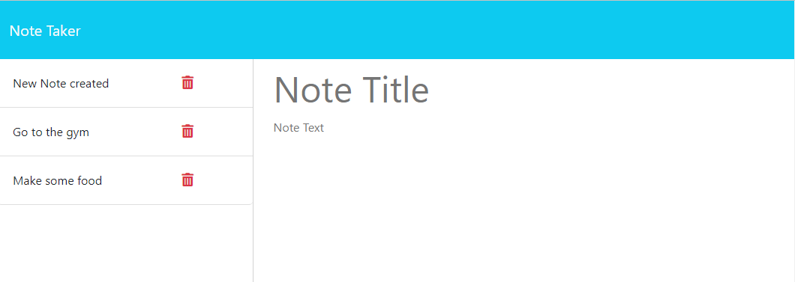

# NoteTaker

## Description

A simple tool that allows the user to create, store, and delete notes with ease. Application was made to practice using express, and much was learned regarding api route usage

## Table of Contents

- [Installation](#installation)
- [Usage](#usage)
- [Credits](#credits)
- [License](#license)

## Installation

No installation required as the app is live on Heroku

## Usage

From the front page, click on the Get Started button. Once you get to go to the other screen, simply add note title and whatever note text is attached to it. Once you do, a save note button should appear in the top right corner, click it to save the note. All previous notes should be displayed on the left hand side, and clicking the trash can icon next to each will delete the note. 

## Credits

Everything is done by Serg Malyshka

## License

---
